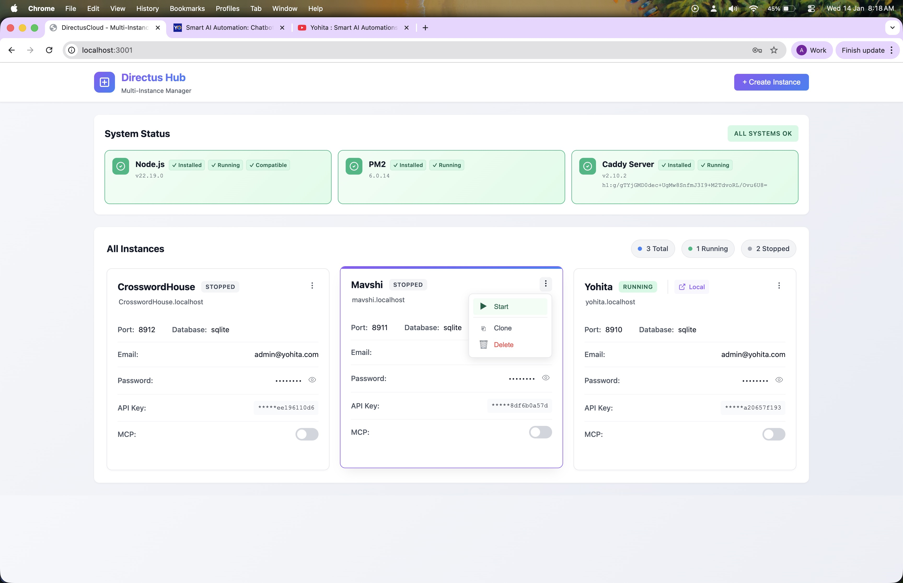
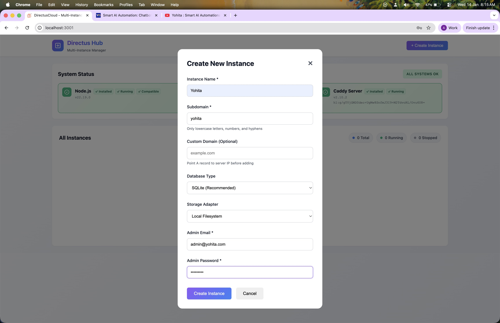
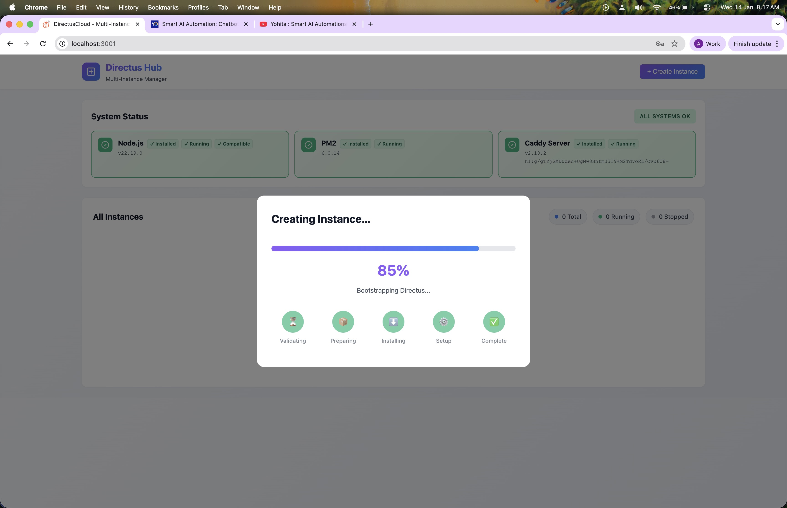
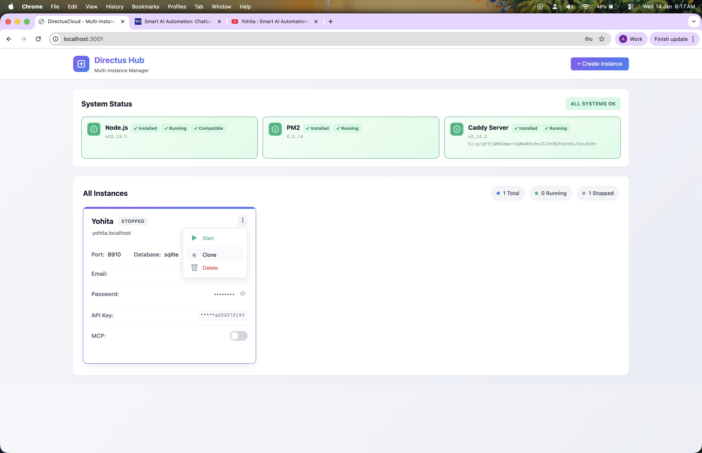
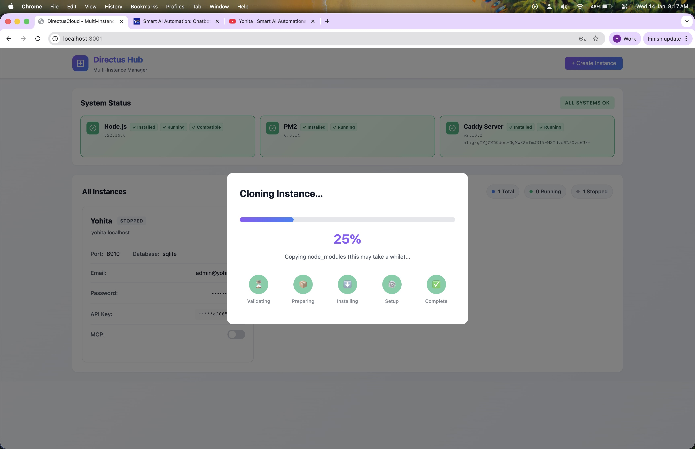

# DirectusCloud - Multi-Instance Directus Hosting Platform

A powerful web-based management application that allows you to create, manage, and host multiple Directus CMS instances on a single server. Each instance runs independently with its own database, storage, and configuration.




## ✨ Features

- **Multi-Instance Management**: Create and manage unlimited Directus instances
- **Unified Dashboard**: Single interface to manage all your instances
- **No Sudo Required**: Runs entirely with user permissions
- **HTTP & HTTPS Support**: Caddy handles automatic SSL certificates via Let's Encrypt
- **Process Management**: PM2 integration for reliable instance management
- **Modern UI**: Clean, responsive interface built with server-side rendering
- **System Monitoring**: Real-time status of Caddy, PM2, and system resources

## 🏗️ Architecture

The project is structured as a unified Node.js/Express application that manages child processes for Directus instances.

```
directus-multimode/
├── app/                  # Unified Express application
│   ├── api/             # API routes and logic
│   ├── components/      # UI components and partials
│   ├── lib/             # Utilities and helpers
│   ├── public/          # Static assets (CSS, JS, Images)
│   ├── views/           # EJS Page templates
│   └── server.js        # Main application entry point
├── instances/            # Directory where Directus instances live
├── data/                 # Application data, PM2 logs, and main DB
├── .env                  # Main configuration file
├── package.json          # Project dependencies and scripts
├── start.sh              # Quick start script
└── stop.sh               # Stop script
```

## 📋 Prerequisites

- **Node.js** 18+ and npm
- **Caddy** (optional, for reverse proxy with HTTPS)
  - macOS: `brew install caddy`
  - Linux: See [Caddy installation guide](https://caddyserver.com/docs/install)

## 🚀 Quick Start

### 1. Configure Environment

Copy the example environment file:
```bash
cp .env.example .env
```

### 2. Install Dependencies

Install the project dependencies:
```bash
npm install
```

### 3. Start the Application

You can start the application using the helper script:

```bash
./start.sh
```

Or directly via npm:

```bash
npm start
```

The application will be available at `http://localhost:3001` (or the port defined in your `.env` file).

## 🎯 Development

### Watch Mode

For development, use the watch mode which automatically restarts the server when files change:

```bash
npm run dev
```

### File Structure

- **Views**: Edit HTML structure in `app/views/`
- **Styles**: CSS files located in `app/public/css/`
- **Logic**: Backend logic in `app/api/` and `app/lib/`

## 🔧 Usage

### Creating an Instance

1. Navigate to the Dashboard.
2. Click **"+ New Instance"**.
3. Enter the instance name, email, and password.
4. The system will create a new Directus instance in the `instances/` directory.
5. Once created, you can Start/Stop/Restart/Clone/Delete the instance from the dashboard cards.


*Creating a new instance*


*Real-time installation progress*

### Accessing Instances

- **Direct Port**: Each instance runs on a unique port (assigned automatically).
- **Subdomain**: If Caddy is configured, instances are accessible via `http://<subdomain>.localhost`.

### Instance Actions

Manage your instances directly from the dashboard card menu.


*Instance management menu*


*Cloning an existing instance*

### Command Line Tools

- **Start All**: `./start.sh`
- **Stop All**: `./stop.sh` - safe shutdown of all instances and the main app.
- **PM2 Logs**: `npm run pm2:logs` - View logs for all running instances.

## 📚 API Documentation

The application provides a REST API for management functions.

- `GET /api/instances` - List all instances
- `POST /api/instances` - Create a new instance
- `POST /api/instances/:id/:action` - Perform action (start/stop/restart/delete)
- `GET /api/system/status` - Get system status (Caddy, etc.)

## 🐛 Troubleshooting

### App won't start
- Check if the defined port (default 3001) is in use.
- Verify Node.js version is 18+.

### Instance creation fails
- Check the application logs: `npm run pm2:logs`.
- Ensure you have write permissions in the `instances` directory.

### Caddy issues
- Ensure Caddy is installed and in your PATH.
- Check the generated Caddyfile in `Caddyfile` for errors.

## 📝 License

MIT License

## 🤝 Contributing

Contributions are welcome! Please feel free to submit issues or pull requests.
